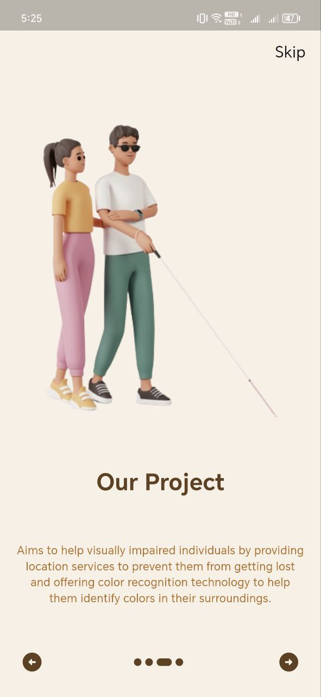
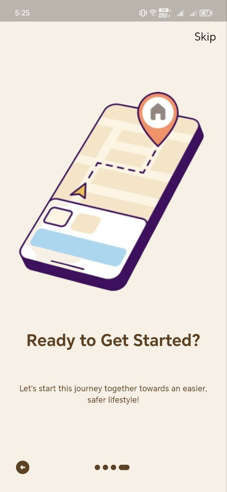
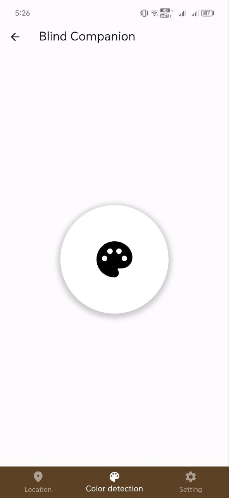

# 🦯 Blind Companion: Assistive System for the Visually Impaired

> A real-time navigation and safety system for visually impaired individuals, using ESP32, Firebase, and Flutter.

---

## 📱 Overview

**Blind Companion** is an assistive system designed to enhance the **mobility**, **safety**, and **independence** of visually impaired users. It combines a **smart stick**, **smart glasses**, and a **Flutter mobile app**, with real-time communication via **Firebase** to provide obstacle detection, color sensing, and GPS-based location tracking.

---

## 🚀 Features

- 🔊 **Obstacle Detection** using ultrasonic sensors and a buzzer (sound-based).
- 🌈 **Color Detection** via a color sensor for object/environment awareness.
- 📍 **Real-Time Location Tracking** with GPS.
- ☁️ **Firebase Integration**: ESP32 sends sensor data to Firebase; the app listens for live updates.
- 📲 **Flutter Companion App**: Tracks the user’s location and receives sensor data remotely.

---

## 🧩 System Architecture

```
[ ESP32 + Sensors ]
   └── Sends real-time data ──► Firebase Realtime Database
                                 ▲
                                 │
[ Flutter App ] ◄──── Receives updates ─────┘
```

---

## 🔧 Hardware Components

| Component         | Function                                        |
|------------------|--------------------------------------------------|
| **ESP32**         | Main microcontroller with Wi-Fi capabilities     |
| **Ultrasonic Sensor** | Detects obstacles in front of the user      |
| **Buzzer**        | Emits sound when an obstacle is detected         |
| **GPS Module**    | Provides real-time location                     |
| **Color Sensor**  | Detects and identifies object/environment colors |
| **Power Supply**  | Battery pack powering the ESP32                  |

---

## 📱 Mobile App (Flutter)

The mobile app connects to **Firebase** to:

- Display the user's **real-time location** on a map.
- Receive and interpret sensor readings.
- Alert the companion when an obstacle is near or when specific conditions occur.

### 📸 App Screenshots
<!-- Replace with actual image paths -->
<p align="center">
  
  
   
   
</p>

---

## 🛠️ Installation & Setup

### 1. ESP32 Firmware
- Use **Arduino IDE** or **PlatformIO**.
- Install required libraries:
  - `WiFi.h`
  - `Firebase_ESP_Client`
  - `TinyGPS++`
  - `Adafruit_TCS34725` (color sensor)

- Upload your firmware code to ESP32 using USB.

### 2. Firebase Configuration
- Create a **Firebase Realtime Database** project.
- Enable **read/write access**.
- Replace Firebase credentials in your ESP32 and Flutter code.

### 3. Flutter App
```bash
git clone https://github.com/asmaa-2ahmed/Blind-Companion
cd Blind-Companion/app
flutter pub get
flutter run
```

> ✅ Ensure Firebase config (`google-services.json`) is properly added.

---

## 🖼️ Smart Stick Image

<!-- Replace with the actual image path -->
<p align="center">
  
</p>

---

## 💡 How It Works

1. **ESP32** collects data from sensors (ultrasonic, GPS, color).
2. Data is pushed to **Firebase Realtime Database** over Wi-Fi.
3. **Flutter App** retrieves data from Firebase and presents:
   - Obstacle alerts
   - Color readings
   - Live map location

---

## 📌 Future Enhancements

- Add **fall detection** with an accelerometer.
- Introduce **SOS alerts** for emergencies.

---
